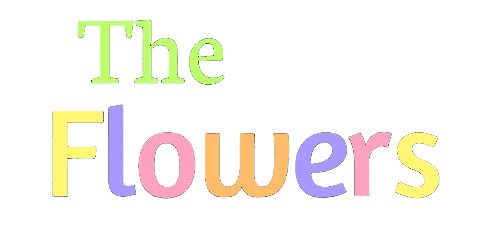

# The Flowers 🌸

> **A Slice of Life Story Portfolio** — Follow four girls, four colors, and one unforgettable tale woven together like petals in a garden.



## 📖 Overview

**The Flowers** is an interactive web-based story portfolio that tells the emotional journey of four middle school girls as they navigate friendship, identity, and personal growth. The story blends slice-of-life narrative with psychological depth, comedy, and school drama—all through the metaphor of different flowers blooming in the same garden.

### 🎭 Core Themes
- **Slice of Life** — Everyday moments that define us
- **Psychological Drama** — Inner conflicts and hidden struggles
- **Comedy** — Light moments that break the tension
- **School Life** — The reality of growing up

## 👥 Characters

### 🌻 Nayara Helia — The Sunshine
- **Age:** 13 years old | **Height:** 137 cm | **Blood Type:** AB
- **Birthday:** September 11 | **Flower:** Helianthus Annuus
- A cheerful girl with a blue-eyed smile, but carries a hidden wound from childhood—the sudden loss of her best friend. Nayara uses her brightness to hide the emptiness inside.

### 💠 Talia Azure — The Unique One
- **Age:** 13 years old | **Height:** 140 cm | **Blood Type:** B
- **Birthday:** March 26 | **Flower:** Dendrobium Azureum
- Hyperactive, impulsive, and hilariously troublesome. Talia makes everyone laugh, but beneath her playfulness lies deep sadness she refuses to share—afraid of showing her fragile side.

### 🌺 Kayshila Cathara — The Perfectionist
- **Age:** 13 years old | **Height:** 142 cm | **Blood Type:** O
- **Birthday:** January 22 | **Flower:** Catharanthus Roseus
- Appears flawless on the surface, but hides warmth and vulnerability beneath. She was Nayara's childhood best friend—until she left without explanation. Now, their reunion brings unresolved tension.

### 🏵️ Mika Lathy — The Energy
- **Age:** 13 years old | **Flower:** Lathyrus Odoratus
- Full of vibrant energy and optimism. Childhood best friends with Talia and the calm balance to her chaos. Mika is the only one who truly understands Talia's hidden pain.

## 📚 Story Structure

### Arc 1: Perkenalan (Introduction)
A new school means a fresh start for Nayara. But when she meets Kayshila—a cold, distant girl—something awakens within her. Fragmented memories, unclear feelings. Four girls are grouped for a school project, and slowly, their unique colors begin to brighten each other's lives.

### Arc 2: Konflik (Conflict)
Shadows from the past creep in. Talia withdraws, carrying secrets. Nayara struggles with being everyone's "sunshine." Kayshila masks her true self. When a school festival incident triggers buried emotions, their newfound bond is tested to its breaking point.

### Arc 3: Pemahaman (Understanding)
In the flower garden where it all began, four girls finally understand what they mean to each other. Not every flower needs to bloom perfectly. Sometimes, growth happens after the harshest winters. They promise: together, spring will always come.

## 🌐 Features

### Interactive Story Navigation
- **3-Arc Story Structure** — Click through multiple narrative arcs
- **Tabbed Story System** — Easily switch between different story points
- **Smooth Scrolling** — Navigate the entire page fluidly

### Character Portfolio
- **Character Cards** — Detailed profiles with stats, personality traits, and character quotes
- **Character Images** — Visual representations of each girl
- **Color-Coded Design** — Each character has a unique flower color palette

### Relationship Map
- **Interactive Relationship Graph** — Visualize connections between characters
- **6 Unique Relationships** — Each with its own story and dynamic
- **Hover Tooltips** — Explore relationship details on hover
- **Dynamic Highlighting** — Click nodes to highlight related connections
- **Smooth Transitions** — Animated connections and responsive interactions

### Visual Gallery
- **Image Gallery** — Collection of story-related artwork
- **Responsive Grid** — Adapts to all screen sizes

### Design Elements
- **Floating Petals Animation** — Random flower emojis fall gently across the page
- **Fade-In Animations** — Elements reveal as you scroll
- **Responsive Design** — Perfect on mobile, tablet, and desktop
- **Custom Scrollbar** — Themed to match the flower aesthetic

## 🎨 Design System

### Color Palette
Each character is represented by a flower-inspired color:

| Character | Flower | Color | Hex Code |
|-----------|--------|-------|----------|
| Nayara | Helianthus (Sunflower) | Yellow | `#f4d03f` |
| Talia | Dendrobium Azureum | Purple | `#a998ff` |
| Kayshila | Catharanthus Roseus (Periwinkle) | Pink | `#ffa2c1` |
| Mika | Sweet Pea | Orange | `#ffbc6b` |

### Typography
- **Primary Font:** Nunito (body text, UI elements)
- **Secondary Font:** Quicksand (headings, section titles)
- **Web Fonts:** Hosted via Google Fonts

## 🛠️ Technical Stack

### Frontend Technologies
- **HTML5** — Semantic markup and structure
- **CSS3** — Modern styling with CSS Custom Properties (variables)
- **Vanilla JavaScript** — No framework dependencies
- **SVG Graphics** — Vector-based relationship map

### Architecture
The JavaScript is organized into three modules:

#### 📄 animations.js
Handles all visual effects and transitions:
- Floating petal animation generator
- Smooth scroll navigation
- Intersection Observer for fade-in effects
- Navbar dynamic shadow on scroll

#### 📋 story-tabs.js
Manages story arc navigation:
- Tab switching logic
- Active state management
- Content display toggling

#### 🔗 relationship.js
Powers the interactive relationship map:
- Relationship data management
- Tooltip display and positioning
- Node click interactions
- Connection highlighting on hover

#### 🎯 main.js
Central initialization:
- Boots all modules on DOM ready
- Coordinates module initialization

### Responsive Design
- **Mobile-First Approach** — Optimized for small screens first
- **Media Queries** — Breakpoints for tablet and desktop
- **Flexible Grid System** — Character cards and gallery adapt responsively
- **Touch-Friendly UI** — Interactive elements sized for mobile use

## 📁 Project Structure

```
The Flowes/
├── index.html              # Main HTML file
├── asset/                  # Images and media
│   ├── TheFlowers.png      # Logo
│   ├── NayaraHelia.jpeg    # Character images
│   ├── TaliaAzure.jpeg
│   └── KayshilaCathara.jpeg
├── css/                    # Stylesheets
│   ├── style.css           # Main styles & color variables
│   ├── navbar.css          # Navigation bar
│   ├── hero.css            # Hero section
│   ├── sections.css        # Page sections
│   ├── relationship.css     # Relationship map styles
│   └── responsive.css      # Mobile responsive styles
├── js/                     # JavaScript modules
│   ├── main.js             # Initialization
│   ├── animations.js       # Visual effects
│   ├── story-tabs.js       # Story navigation
│   └── relationship.js     # Relationship map logic
└── README.md               # This file
```

## 🚀 Getting Started

### Prerequisites
- A modern web browser (Chrome, Firefox, Safari, Edge)
- No dependencies or build tools required!

### Installation
1. Clone the repository:
```bash
git clone https://github.com/yourusername/the-flowers.git
cd the-flowers
```

2. Open in your browser:
```bash
# Simply open index.html in your default browser
open index.html

# Or use a local server (Python)
python -m http.server 8000
# Then visit http://localhost:8000
```

### Usage
- **Navigate the site** using the top navigation bar
- **Read the story** by switching between three story arcs
- **Explore characters** with detailed character cards
- **Discover relationships** by interacting with the relationship map
- **View the gallery** for additional artwork

## 🎬 Features Explained

### Story Tabs
Click between the three story arcs (Perkenalan, Konflik, Pemahaman) to follow the complete narrative journey.

### Character Cards
Each character card includes:
- Character illustration
- Basic stats (birthday, height, blood type)
- Color-coded flower association
- Personality description
- A meaningful character quote

### Relationship Map
The interactive map shows:
- **6 unique relationships** between 4 characters
- **Color-coded connections** representing relationship types
- **Hover tooltips** with detailed descriptions
- **Click interactions** that scroll to relevant character cards
- **Dynamic highlighting** of related connections

### Animations
- **Floating Petals** — Random flower emojis drift across the page continuously
- **Fade-In Effects** — Elements animate into view as you scroll
- **Smooth Scroll** — Navigation smoothly scrolls to sections
- **Responsive Hover** — Interactive feedback on all elements

## 🌟 Special Features

### No External Dependencies
The entire project uses pure HTML, CSS, and JavaScript—no frameworks, no npm packages, no build process. Just open and play!

### Mobile Optimized
Every element is designed with mobile-first principles:
- Touch-friendly buttons and interactive areas
- Responsive grid layouts
- Optimized font sizes for readability
- SVG graphics that scale perfectly

### Accessible
- Semantic HTML structure
- Keyboard navigation support (smooth scroll)
- Color-coded information (with text alternatives)
- Clear visual hierarchy

### Performance
- No external JavaScript frameworks
- Optimized SVG relationship map
- CSS variables for efficient theme management
- Lazy-loaded animations

## 🎨 Customization

### Change Colors
Edit CSS variables in `css/style.css`:
```css
:root {
  --helianthus: #f4d03f;        /* Nayara's color */
  --azureum: #a998ff;           /* Talia's color */
  --catharanthus: #ffa2c1;      /* Kayshila's color */
  --sweetpea: #ffbc6b;          /* Mika's color */
  /* ... more variables */
}
```

### Update Character Information
Edit character data directly in `index.html` character card sections or in `js/relationship.js` for relationship data.

### Modify Story Content
Update story text in `index.html` within the story content sections (`#arc1`, `#arc2`, `#arc3`).

## 📝 Content

### Story Format
The story is told through:
1. **Introduction Section** — Overview and premise
2. **Three Story Arcs** — Complete narrative progression
3. **Character Profiles** — Detailed character information
4. **Relationship Map** — Character dynamics visualization
5. **Gallery** — Supplementary artwork

### Language
- **Primary Language:** Indonesian (Bahasa Indonesia)
- **Culture:** Indonesian school setting (SMP = Middle School)
- **Tone:** Emotional, relatable, slice-of-life storytelling

## 🔮 Future Enhancements

Potential additions to enhance the experience:
- [ ] Character voice lines (audio)
- [ ] Manga-style panels for story sequences
- [ ] Interactive story choices (branching narrative)
- [ ] Character relationship timeline
- [ ] Fan art gallery integration
- [ ] Multi-language support
- [ ] Story PDF/eBook export
- [ ] Character spotlight animations

## 📄 License

This project is a creative portfolio piece. For usage rights, please contact the creator.

## 👨‍💻 Creator

**The Flowers** — An original story created as a personal portfolio project exploring web design, interactive storytelling, and character development.

---

## 📞 Contact & Support

Have questions about the story or the website?
- Check the relationship map for character connection details
- Explore all three story arcs to understand the full narrative
- Read character profiles for personality insights

---

**Made with 💜 for all who appreciate stories about growth, friendship, and the quiet beauty of adolescence.**

**"Four flowers blooming in the same garden. Four colors. One unforgettable spring."** 🌸🌺💠🏵️
